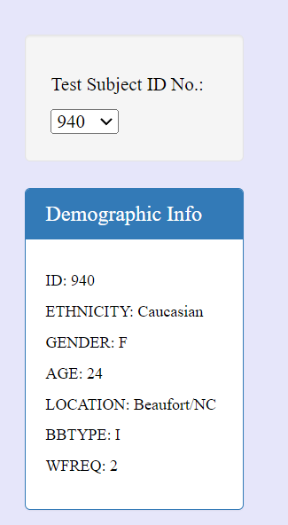
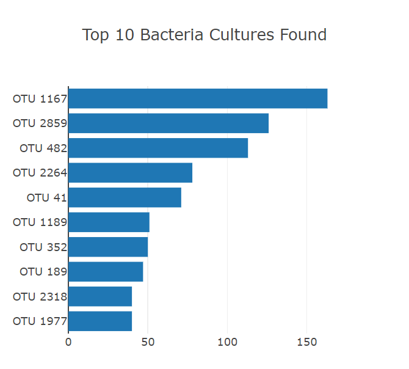
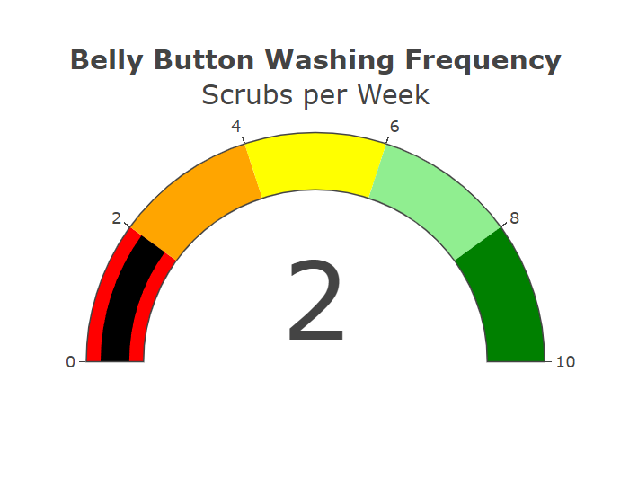
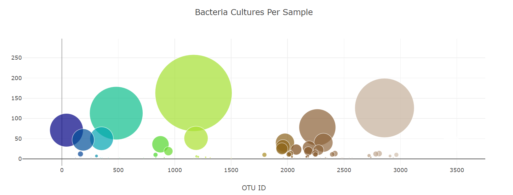

## Overview of Project
Improbable Beef is searching for the elusive bacteria that will provide the perfect taste. Roza believes the ideal bacteria species to make synthetic beef, may be found in the belly button. After gathering all the data from Roza’s research, the Belly Button Biodiversity Dashboard was created. Filtered by Test Subject Identification Number, the subject’s demographic information can be found. Thereafter, the Top 10 Bacteria Cultures are identified using a bar graph for all subjects tested. These results reflect the most common bacteria found was OUT 1167 and the least was OUT 1977. The following section of the dashboard is a gauge graph of each subject’s belly button washing frequency. This graph and data changes change as the various subjects are selected. Lastly, a scatter plot chart shows the bacteria cultures per sample for all subjects tested. This dashboard is an easy way to discover Roza’s research’s results in simple terms. Interested parties would have to select the subject’s ID number to easily find subject-specific data. Data for all subjects tested is shown as well.
### Test Subject ID Filter

### Top 10 Bacteria Cultures

### Wash Frenquency Per Subject

### Bacteria Cultures Per Sample

